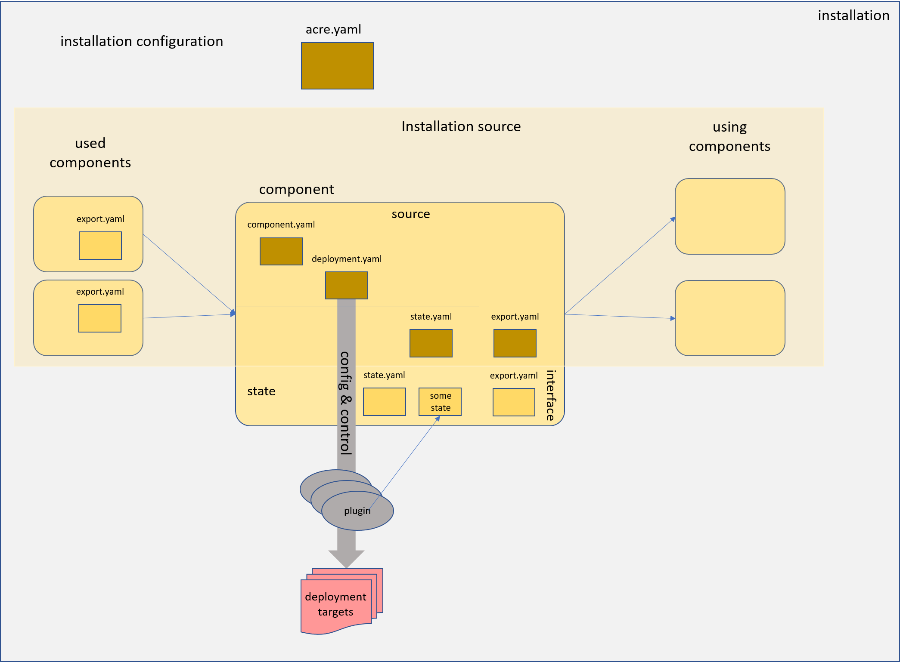
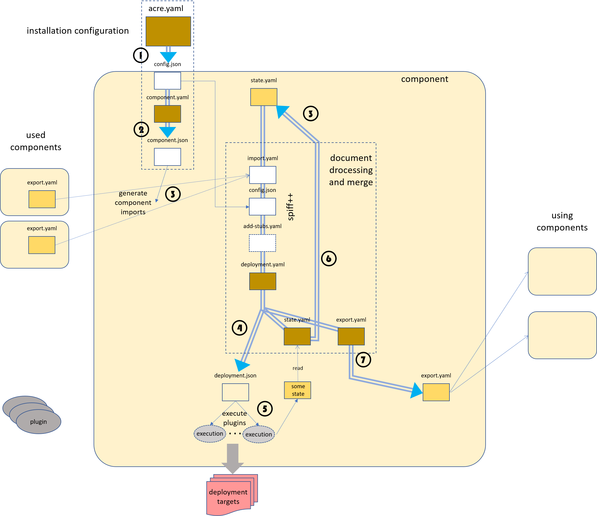

```
                                   ______  ____   _____        __ ______    
                                  / / / / / ___| / _ \ \      / / \ \ \ \   
                                 / / / /  \___ \| | | \ \ /\ / /   \ \ \ \  
                                / / / /    ___) | |_| |\ V  V /     \ \ \ \ 
                               /_/_/_/    |____/ \___/  \_/\_/       \_\_\_\
                       
```
---

# Sow - a tiny Installation Orchestration Framework

_Sow_ is not yet another installation tool. It is
not able to handle installation steps by its own.
Instead it is used to describe and execute an
orchestration of multiple installation components
based on arbitrary installation
tools, like _terraform_, _helm_, _kubectl_, etc.

The tool itself only handles the information flow
among those installation components and controls
their execution order.

<p align="center">


</p>

Each _installation component_ is described by a set of
yaml documents. This is used together with an installation
configuration and information provided by used components
to generate a deployment configuration  and a contract intended
to be used by other components.

The deployment configuration consists of a
sequence of plugin execution requests and their configuration.

The installation plugins are shell modules or executables
delivered with the tool itself or provided by the installation content.
_sow_ finally just generates the plugin config and executes the plugins
in the appropriate order.

## Overview

A _component_ is described by a set of yaml documents.
The `component.yaml` describes the dependencies to other
components. A `deployment.yaml` describes the configuration
for the plugin executions. The component may
_export_ structured yaml values to be used by other components (the contract),
again described by a yaml document (`export.yaml`) and keep a state in form
of a yaml document (`state.yaml`) or other files.

The information flow is described by the component dependencies
and an installation configuration.
Therefore _sow_ processes the yaml documents with the
[_spiff++_ in-domaim templating engine](https://github.com/mandelsoft/spiff/blob/master/README.md)
by providing appropriate merge stubs based on
the exports of the dependencies and the last local state.
This allows to describe the calculation of the effective document versions
in-place with `dynaml` expressions evaluated by _spiff_.

<p align="center">



</p>

The dependencies are also used to determine the appropriate
deployment and deletion order for the components of
an installation source.

An _installation source_ is a set of components bundled
in a dedicated filesystem structure. This could, for example,
be stored and versioned in source code management systems like
_git_. The installation sources might be nested, this means
an installation source may also include other installation
sources. With git, this could be done using submodules.
In any way the result is a closed filesystem structure
containing the complete installation source.

Finally a _landscape_ describes a concrete installation
as instance of an installation source. It is again described
by a dedicated closed file system structure containing the
installation source and a yaml document containing the
configuration values for the dedicated installation.
This configuration will also be part of the template
processing of the various configuration
files provided by the installation components.

During the installation
process, this filesytsem structure will also be used to hold
the state of the installation components.
It can again be versioned using a versioning system.
With git, for example, the installation source can be
added and versioned by a git submodule.

## The Wording

_Sow_ is not meant as noun, but verb, in the sense of the
required action to till the soil. It is used to _sow_ the
seedlings of different kinds or _species_ found in
_greenhouses_ in the field, or _acre_.

The first use case is to install a garden with a
[gardener](https://github.com/gardener/gardener) on
a kubernetes cluster.

## The Filesystem Structure

```
├── acre.yaml                  # config of the concrete installation instance
├── crop                       # the installation source for the landscape
│   ├── acre.yaml
│   ├── components             # components of the root installation source
│   │   ├── comp1
│   │   │   ├── component.yaml
│   │   │   ├── deployment.yaml
│   │   │   └── export.yaml
│   │   ├── nested            # components may be nested
│   │   │   └── comp2
│   │   │       ├── component.yaml
│   │   │       ├── deployment.yaml
│   │   │       ├── lib       # convention: any kind of library
│   │   │       │   . 
│   │   │       │   . 
│   │   │       │   
│   │   │       ├── action    # optional: direct plugin code, deploy/delete code
│   │   │       ├── plugins   # optional: folder for local plugins
│   │   .       └── export.yaml
│   │   .
│   │
│   ├── lib                   # convention: folder for any kind of libraries
│   │   ├── sow.sh            # optional sow extension script
│   │   .
│   │   .
│   │
│   ├── plugins   # optional: folder for plugins provided by product
│   │
│   └── greenhouses           # recursively included installation sources
│       └── nestedproduct     # name as root of the installation source
│           ├── other product folders (see above)
│           └── components
│               ├── testcomp
│               │   ├── component.yaml
│               │   ├── deployment.yaml
│               │   .
│               │   .
│               │   .
│               │    
│               ├── greenhouses  # recursively included installation sources
│               │   ├── othernestedproduct
│               │   .
│               .   .
│               .   .
│               .
│
├── state                       # state that needs to be persisted
│   ├── <components>
│   .
│   .
│   .
│
├── export                      # information flow among components
│   ├── <components>
│   .
│   .
│   .
│
├── gen                         # temporary files (can be deleted at any time)
│   ├── <components>
.   .
.   .
.
```

## The control files

### `acre.yaml`

This file may contain any configuration information in any 
structure required by the installation source.

A convention is to use a node `landscape` to hold the
configuartion information. 

Using dedicated elements has an advantage for the later merging process,
because it avoids undesired overrides and allows access to dedicated
kinds of information for the yaml interpolation steps.

This document is processed by spiff using an optional `acre.yaml` located
in the root installation source as template.
Tis template can be used to provide defaults or to check required values
in the configuration (using _spiff_ features).

The processing result is stored in `gen/config.json`. This file
is used as stub for the processing of the other control files.

The `meta.installationHandler` node can be used to configure an installation handler.

```yaml
meta:
  installationHandler:
    path: <path to executable bash file>
    config: <optional, arbitrary yaml>
```

If configured, the referenced script will be called once before any call to `sow` (except for `sow version` and `sow help`) with argument `prepare` and once after the `sow` command with argument `finalize`. If the prepare step fails, neither the `sow` command, nor the finalize part will be executed. If the `sow` command fails, the finalize step will still be executed.

Whatever you provide in the (optional) `config` node will be given to the script as a second argument in form of a JSON string.

### `component.yaml`

This file indicates the root folder of a component. It is used by
_sow_ to extract control information for the component held in
the node `component`.

So far, three fields are used:

- `imports`: a list of components the actual component depends on.
   The import can be labeled by using the syntax 

   <p align="center">
   &lt;label&gt;: &lt;component name&gt;
   </p>

   If a component is a nested component (containing a `/`), there should be a label
   to simplify the access during the interpolation process later on.

- `stubs`: a list with stub files that should be added to the merging
   processess for the other control files. These files typically
   contain settings or utility functions, that should be used during the
   interpolation process.
   The given file names should be relative paths. They are looked up
   - locally to the component
   - locally to the installation source
   - locally to the _sow_ tool root

- `active`: boolean value indicating whether this component is active in
  the actual landscape.

- `plugins`: plugin definitions (see [deployment.yaml](#deploymentyaml))
  called before deployment evaluation (action `prepare`) and after deletion
  steps (action `cleanup`).

This file is processed by _spiff_ using the landscape configuration
and the tool's `component.yaml` template file as stub.

### `deployment.yaml`

This document is used to describe the used deployment plugins for a component and
their configuration settings.
It is processed by _spiff_ using some stub files.

- the last state document (described by `state.yaml`)
- the actual execution environment (see below)
- the import information (see below)
- the effective installation configuration `gen/config.json`
- additional stubs described by the `component.yaml`

The environment stub contains the node `env` with fields describing the
actual component environment:

- `COMPONENT`: the component name
- `GENDIR`: component specific folder for temporary files
- `STATEDIR`: component specific folder for persistent files
- `EXPORTDIR`: component specific folder for contract files
- `ROOTDIR`: installation root directory
- `ROOTPRODUCTDIR`: installation source directory
- `PRODUCT`: in case of nested products the product name
- `PRODUCTDIR`: the root directory of the component's product

_sow_ evaluates the dependencies and generates an additional stub file
containing the exports of all imported components.
They are stored with their _label_ below the node `imports`.

The effective deployment configuration is stored in the `gen` directory below
the component folder. The deployment template also declares state fields
(using the `&state` marker in dynaml) whose content should be kept for the
next processing. It is automatically added to the stub list as top-level stub.
If a manual merge should be done with the latest state such a node
has to disable the auto.merge, also, by adding a `merge none` expression.
(See state support of [spiff++](https://github.com/mandelsoft/spiff/README.md(#-state-)

The generated effective deployment manifest should contain a `plugins` node
listing the plugins that should be executed.  A plugin entry may take
additional string arguments and a configuration.

```yaml
plugins:
  - echo: "deploying a secret"
  - kubectl:
      config: # <yaml config for kubectl plugin>
        kubeconfig: (( landscape.cluster.kubeconfig ))
        manifests:
          - apiVersion: v1
            kind: Secret
            ...
  - echo:
     - "Happy"
     - "sowing"
  - echo:    # this is the complete form for specifying a plugin
     config: 
     path: echo
     args:
       - "Happy"
       - "sowing"
```

By convention, if arguments are used and the plugin requires a configuration
the first argument describes the path of the yaml node that
contains the configuration for the plugin call. By default a plugin
should assume its name as path. The better way is to specify the
configuration directly in the plugin node as described above.

The denoted path should contain the actual configuration for
the plugin. This way the same plugin can be called multiple times
with different settings.

If a `path` is given it is used as sub folder to store information
for the actual plugin execution, to separate multiple occurrences
of a plugin in the plugin list. By default the plugin name should be
used as `dir`

If the plugin name start with a `-`, its execution is not notified
on the output. This can be used for the `echo` plugin to
echo plain multi line text.

#### Execution order

The execution order is taken from the list order and reversed for the deletion
of a component.

To always use a dediacted order, for example to use a plugin to prepare the 
input for the next one, a dedicated order can be pinned for a dedicated sequence
of plugins. 

This is done done with a built-in plugin called `pinned`. It takes
a list of regular plugin specifications that are always executed in the given
order.

To declare a list of plugins using the standard (unpinned) behavior, the
built-in plugin `unpinned` can be used.

If multiple plugins can be be executed in parallel, the build-in plugin
`parallel`can be used. Like `pinned` and `unpinned` it accepts a list of
plugins.

The `pinned` and `unpinned` plugins can be used inside `parallel` to include
a list of pligins with a defined execution order.

#### Built-in Plugins

There is an internal interface for built-in plugin. The `pinned` plugin is an
example for such a plugin. Built-in plugins could be loaded by the command
extension mechanism offered by `sow`, or even by the optional action
script of a component.

A built-in plugin is just a shell function with the prefix `BUILTIN_`.
It must take three arguments:

- $1: the action (deploy, delete, prepare or cleanup)
- $2: the plugin exection specification as json
- $3: the original document declaring the plugin execution

The execution spec includes a `name` field and an optional `args`, `path` or
`config` field. The simplified spec (see examples above) always provide
the `args` field, if the execution is configured as list field. It may contain any deep list structure as given by the spec in the original yaml. If a map is
given the map fields are directly contained in the root level map besides the
name field.

If the execution config is not part of the plugin execution declaration,
it is the task of the plugin to access the config in the original document, if
required. There is no predefined file system based contract as for regular
plugins.

There are some predefined built-in plugins:

- `pinned`: execute list of plugins always in the given order (for creation and deletion)
- `unpinned`: execute the plugins in the reversed order for deletion
- `parallel`: execute plugins in parallel

#### Action Script

A component may contain an `action` script below its root folder.
This script file is `sourced` by a bash executing an action. It
may define builtin plugins (using the internal builtin interface) or regular
plugins just as shell function. Any shell function defined here
can be called as regular plugin just by its name for the descriptor files.

### `export.yaml`

This file should describe the information intended for reuse by other
components. By convention it should be stored below an `export` node.
The file is optional, if there are no exports.

It uses the generated effective `deployment.yaml` and all the stubs used for
its processing as stub. It also contains the actual state, therefore the
state file is omitted.

If it contains a `files` section the listes files (structure with `path` and
`data` fields) are written to the components export folder. Optionally the
file mode is specified with `mode`.

### The Generation Process

<p align="center">



</p>

The data flow is heavily based on the processing of yaml documents
with _spiff++_.

Every component is processed separately.

1. the installation configuration is processed together with a
  configuration template provided by the installation source. The result
  is an effective installation configuration stored in the `gen` folder.
2. the `component.yaml` is processed together with the installation
  configuration used as stub to achieve the effective component meta data.
  Here, dedicated components can be activated or deactivated, or dependencies
  might be adjusted according to the actual installation configuration.
3. the component meta data is evaluated to determine the effective
  component dependencies and stubs used for the further processing.
  The export information of the used components are gathered and aggregated
  into a single import file.
4. the `deployment.yaml` is processed to determine the concrete
  plugin sequence, their configuration settings (4b) which is stored in the
  `gen` folder of the component and the actual (maybe updated)
  state (4a) replacing the old state held in the state folder. Therefore the
  state support of `spiff++` is used.
5. the effective deploment configuration is evaluated and the plugin
  set and order is determined. Then the plugins are called in the
  appropriate order together with their dedicated configuration settings.
  The plugins might access and provide own instance specific state information.
  (For example a `terraform.thstate` file).
6. the optional `export.yaml` is processed together with the actual generated deployment
  manifest and all other stubs (except the state.yaml) to generate the
  contract information for using components. The effective `state.yaml` is
  stored in the `export` folder of the component.

## The command

_Sow_ evaluates the current working directory fo figure out

- the concrete installation folder
- the actual product
- the actual component

This information is then used as default for its execution.

By default _sow_ interprets its arguments as components that should be
deployed and executes their deploy actions in the appropriate order.

The following sub commands are supported:

- `deploy`:   (default)  deploy components
- `delete`:   delete components
- `show`:     show meta data of given components
- `info`:     show info about actual position in filesystem
- `version`:  show tool version
- `generate`: generate manifests without action execution
- `order`:    show order of components and/or their deploy or deletion order
- `add`:      create the frame for a new component
- `vi`:       lookup or edit component related files in component specific folders
- `diff`:     compare old and new version of generated files

The command supports the following options:

- `-a`: complete the component list
        for `info` it shows the complete component and product list
        for `deploy` and `delete` completes the deploy and delete
        order according to the configured component dependencies.
- `-A`: `deploy`and `delete` work on all active components
- `-m`: use given component names as pattern to match against filesystem and
        component list
- `-n`: no redeploy, just do new deployments
- `-k`: keep temporary files
- `-X` \<plugin\>: enables trace mode for given plugin
- `-x`: enables trace mode
- `-v`: enables verbose mode

`sow help` prints a complete list of commands with supported options.

If a file `.sowrc` exists in the user's home directory it is sourced
prior to any command execution.

## Plugins

Plugins are used to execute the real installation work.
There are several plugins delivered with the tool, but an installation
source or even a single component might provide own or replace existing plugins.

### API

A plugin is just an executable or shell script. The provided plugins are all
shell scripts.

There is a combined environment and command line interface for the execution
of plugins.

In the environment environment variables are provided for a dedicated execution:

- `DEPLOYMEMT`: The manifest file the plugin execution is taken from
- `PLUGINCONFIG`: A file containing the configuration configured in the plugin
                  specification in the above manifest
- `PLUGININSTANCE`: The configured plugin instance name/path
- `GENDIR`: The place to store temporary files for the component
- `STATEDIR`: The place to store persistent (state relevant) files for the component
- `EXPORTDIR`: The place to store files intended for reuse by other components.
- `SOWLIB`: Library path for shell libraries offered by _sow_.

In former versions the json content was given directly by environment variables.
This might cause problems with the length of argument space for process
creation, therefore it has been changed to file names.
Those changes are handled automatically when using the `PLUGIN_setup` call
or by sourcing the `pluginutils` library (see below).

Using a complete plugin call specification (using the config/args) field
the first variable should never be used.
If only the arguments are used in the plugin call specification and the
plugin requires further configuration, it should be taken from
the json file provided in `DEPLOYMEMT`

If the plugin call specification givens the `path` field it is passed in the
`PLUGININSTANCE` variable.
This should be used as sub folder path for instance specific data stored below
`GENDIR`, `STATEDIR` or `EXPORTDIR`, to separate different usages of the same
plugin in a component.

If no config is given, but required by the plugin this value should also be used
to lookup the config in the `DEPLOYMENT` file. If it is not given
a convention here is to specify the path of the configuration field
as argument, defaulted by the plugin name.

### Shell scripts as plugins

If a plugin is implemented by a shell script, there is a library that handles
the contract described above. It can be used by

```sh
source "$SOWLIB/pluginutils"
```

It always provides the variable `PLUGINCONFIGJSON` containing the configuration
of the actual plugin call in json format and the variable `PLUGININSTANCE`.
Their values are fed according to the actual settings and conventions. It also
sets the variables

- `dir`: GENDIR location for the execution
- `state`: STATEDIR location for the execution

and assures their existence.

The evaluation of environment and arguments alone is done by the shell function
`PLUGIN_setup` offered by the `utils` library.

Additionally it loads the standard utils library from the _sow_ tool, that
offers functions for (colored) output and json access
(see [lib/utils](lib/utils)).
